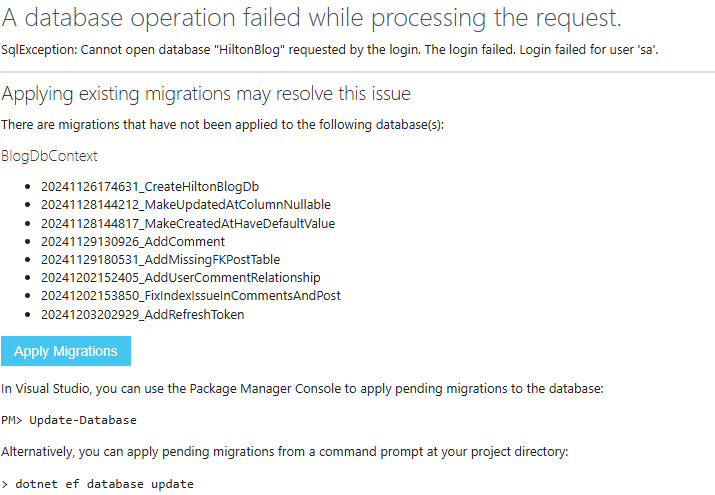

# VoyagerTravelBlog

A modern blog API built with .NET 8 and Clean Architecture principles. Features user authentication with JWT tokens, blog post management, comments, and media uploads, all backed by Azure SQL and deployed to Azure App Service.

## Prerequisites

Before running this project, ensure you have the following installed:

- [.NET 8 SDK](https://dotnet.microsoft.com/download/dotnet/8.0)
- [Docker Desktop](https://www.docker.com/products/docker-desktop/) (for local development)
- [Azure CLI](https://learn.microsoft.com/en-us/cli/azure/install-azure-cli) (optional, for Terraform)
- [Terraform](https://developer.hashicorp.com/terraform/tutorials/aws-get-started/install-cli) (optional, for infrastructure)

## API Overview

| Endpoint | Description |
|----------|-------------|
| `POST /api/auth/login` | Authenticate user and get JWT token |
| `POST /api/auth/refresh` | Refresh access token |
| `GET /api/posts` | Get all blog posts |
| `POST /api/posts` | Create a new post |
| `GET /api/posts/{id}` | Get a specific post |
| `PUT /api/posts/{id}` | Update a post |
| `DELETE /api/posts/{id}` | Delete a post |
| `GET /api/posts/{id}/comments` | Get comments for a post |
| `POST /api/comments` | Add a comment |
| `GET /api/users` | Get all users |
| `POST /api/users` | Create a new user |

## Running Locally

### Option 1: Docker Compose (Recommended)

Run the command to build the image and create the needed containers:

```bash
docker-compose up
```

ℹ️ Add the `-d` flag to run in detached mode.
ℹ️ Add the `--build` flag to rebuild the image.

### Option 2: .NET CLI

1. Add the following `secrets.json` for local development:

```json
{
  "JwtSettings": {
    "AccessTokenExpirationMinutes": 30,
    "Audience": "your-audience",
    "Issuer": "your-issuer",
    "RefreshTokenExpirationDays": 7,
    "SecretKey": "your-development-secret-key"
  }
}
```

2. Run the API:

```bash
dotnet run --project VoyagerTravelBlog.Api
```

> **Note:** In non-dev environments, JWT settings should come from Azure Key Vault.

### Applying Migrations

When running locally, access the API at `{base-url}/api/posts`. If migrations haven't been applied, you'll see this screen:



Click the **Apply Migrations** button, and you're ready to go! 🎉

### Stopping Containers

To remove the containers:

```bash
docker-compose down
```

ℹ️ Add the `-v` flag to remove volumes.

> **Note:** The database uses a named volume `sqldata` that persists data. To fully reset the database:
> ```bash
> docker volume rm VOLUME_NAME
> ```

## Terraform (Infrastructure)

This project uses Terraform to provision Azure infrastructure. See [main.tf](./infrastructure-azure/main.tf) for the resource overview.

> *We don't need to manually run Terraform—the GitHub Action Workflow handles this on push to master.*

### Run Terraform Locally

All commands should be run from the `infrastructure-azure` directory, or use `-chdir=infrastructure-azure/`.

#### 1. Authenticate with Azure:

```bash
az login
```

#### 2. Initialize Terraform:

```bash
terraform init
```

#### 3. Plan the infrastructure:

```bash
terraform plan -var-file="dev.tfvars" -out=tfplan
```

👆 This validates your configuration before applying.

#### 4. Apply the infrastructure:

```bash
terraform apply tfplan
```

ℹ️ Add `-auto-approve` to skip the confirmation prompt.

### Formatting Terraform Files

Before committing changes, format your Terraform files:

```bash
terraform fmt
```

Validate formatting:

```bash
terraform fmt -check
```

👆 No output means everything is correct.

### GitHub Approval Process

Terraform changes require manual approval via GitHub Issues. Respond with `approved`, `approve`, `lgtm`, or `yes` to proceed, or `denied`, `deny`, `no` to cancel.

## Postman

This project includes a Postman collection: `VoyagerBlogAPI.postman_collection.json`

Import it into Postman to easily test the API endpoints.

### Antiforgery Token Note

This API uses Antiforgery Tokens for CSRF protection. The Postman collection includes a post-response script that automatically updates the token. However, after logging in, you'll need to make any GET request first to refresh the token with your authenticated claims before making POST/PUT/DELETE requests.
